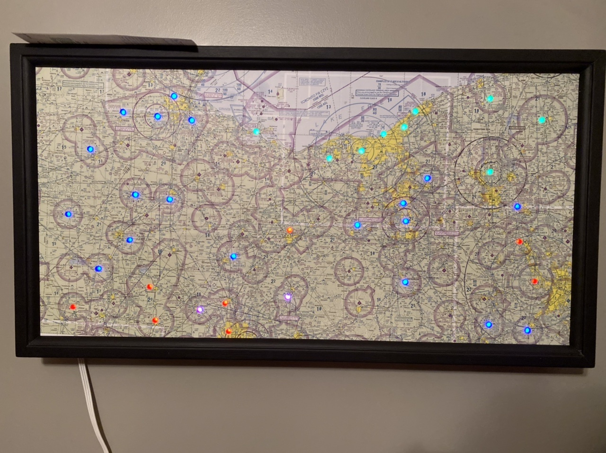

# VFR Light Map



This is a fork of Dylan Rush's, John Marzulli's, and James Russo's excellent "[Categorical-Sectional](https://github.com/dylanrush/categorical-sectional)".

I've fixed a few issues that are noted under the Issues tab, created a few new programs of varying usefulness that can be found in the "misc" folder (and are described below), and heavily modified this readme file with instructions for WS2811 LEDs and other various information.

## What You Need

### Skills Required

To complete this project you will need to:

- Edit two text files.
- Solder two wires.

### Additional Hardware

The instructions given here are for WS2811 LED based strands, such as those found on AdaFruit.

The electronics cost about \$90 USD if you are buying everything new, and want 50 lights.

To complete the project you will need to supply your own chart and backing board.

Soldering is required for two (2) wires, along with some electrical tape.

To finish the instalation you will need a monitor, and a keyboard.

#### Other Raspberry Pis

A parts manifest lists a Raspberry Pi Zero due to its size and lower power consumption, but a spare 2 or 3 will work as long as it has WiFi. The wiring diagram does not change.

## Setup

### Parts List

| Description                                  | Cost    | Link                                                                                                                                                                   |
| -------------------------------------------- | ------- | ---------------------------------------------------------------------------------------------------------------------------------------------------------------------- |
| Raspberry Pi Zero W                          | \$29.99 | <https://www.amazon.com/CanaKit-Raspberry-Wireless-Starter-Official/dp/B06XJQV162/ref=sr_1_7?s=electronics&ie=UTF8&qid=1528557992&sr=1-7&keywords=raspberry+pi+zero+w> |
| 5 volt, 5 amp power supply with barrel adapter                   | \$14.99 | <https://www.amazon.com/ALITOVE-Converter-5-5x2-1mm-100V-240V-Security/dp/B078RT3ZPS/ref=sr_1_3?crid=3NW2K0T4PQ7&dchild=1&keywords=5+volt+5+amp+power+supply&qid=1587403440&sprefix=5+volt+4+a%2Caps%2C172&sr=8-3>                                                                             |
| Individually addressable LEDs (WS2811 based) | \$14.99 | <https://www.amazon.com/ALITOVE-LED-Individually-Addressable-Waterproof/dp/B01AG923GI/ref=sr_1_5?dchild=1&keywords=ws2811+led&qid=1587403543&sr=8-5>                           |
| 3 Pin JST SM Plugs                           | \$10.99  | <https://www.amazon.com/ALITOVE-Female-Connector-WS2812B-SK6812-RGBW/dp/B071H5XCN5/ref=sr_1_4?dchild=1&keywords=3+pin+jst+plugs&qid=1587403576&sr=8-4>                        |

### Bootstrapping The Raspberry Pi

#### OS Instalation

This section gets you started with instaling the software.

A full tutorial on how to install the Operating System is available at: <https://www.raspberrypi.org/documentation/installation/noobs.md>

1. Boot the Raspberry Pi with the empty SD card.
2. You will be given a choice of operating systems to install. You will also be asked for your WiFi network and password.
3. Choose the WiFi network that will be used when the project is completed.
4. Choose "Raspbian" as the operating system.
5. When it is finished, login with the username:pi password:raspberry

#### Get The Code

From the command line, after logging in:

```bash
cd ~
git clone https://github.com/masonclouse/categorical-sectional.git
```

This will install this software onto the Raspberry Pi.

#### Python Package Install

From a terminal on the Raspberry Pi

```bash
cd ~/categorical-sectional
sudo python3 setup.py develop
```

#### Install NeoPixels:

```bash
sudo python3 -m pip install --force-reinstall adafruit-blinka
```
```bash
sudo pip3 install rpi_ws281x adafruit-circuitpython-neopixel
```

#### Install remote desktop (optional):

```bash
sudo apt-get install xrdp
```

#### Raspberry Pi Settings

Run 'raspi-config' and enable the SPI bus under Interfacing Options.

```bash
sudo raspi-config
```

## Wiring

### Wiring the WS2811

Refer to the LED documentation to determine whether the male or female end of the LED strand is the input side. This is important as the LEDs will only work if power is supplied to the right end of the strand.

If you are using multiple strands of lights, plug them together.
Tape off the red and blue tap wires between the connectors and at the output end of the strand.

Leave the red and blue wire at the input end for the moment.

### The Barrel Jack Adapter

For the barrel jack, use the two thinner wires that come out of the input end of the LED strand.

One is red, the other blue.

- Red -> Barrel jack positive
- Blue -> Barrel jack negative

#### Wiring Detail For Barrel Jack


#### Wiring WS2811 lights

If the female end of the LEDs is the input side, attach a male JST connector to the pi, and vice versa.

Solder the JST connector to the pi such that each wire on the LEDs will be connected to the correct GPIO port.
- Data wire --> GPIO18
- Ground wire --> GND
- There will be one wire on the JST connector that doesn't get soldered to the board. Tape this one off.

## Final Assembly

- Connect the JST and LED connectors together.
- Connect the barrel jack into the NeoPixel strip.
- Plug in the NeoPixels first, then the Raspberry Pi.

## Understanding The Configuration Files

All of the configuration files will be in the "data" sub directory.

Unless you are building the same exact map that I did (Ohio), then you will want to modify at least one of these.

### data/config.json

This is the first file loaded. It tells the software what type of lights are being used, and which airport file to open.

```json
{
  "mode": "ws2811",
  "pixel_count": 50,
  "gpio_port": 18,
  "airports_file": "data/kawo_to_kosh.json",
  "night_lights": true,
  "night_populated_yellow": false,
  "night_category_proportion": 0.05
}
```

#### night_lights

Set this to true if you would like the weather stations to change colors based on the time of day.

If you are using WS2811 lights, then this is a gradual process.

First the light will fade from the flight condition color to a bright yellow to indicate "Populated night".
As the station gets darker, the light fades to a darker yellow by the time the station is "pitch black" in night.

In the morning, the light will increase back to a bright yellow as the office sunrise time approaches.
As the station approaches full daylight, the light will fade from bright yellow to the color appropriate for the flight condition.

#### night_populated_yellow

Set this to true if you would like the day/night transition to show stations that are currently in "full dark" using yellow.

This will transition/fade into yellow from the standard category color.

Setting this to false will result in the category color fading. The amount the category fades is determined by `night_category_proportion`

#### night_category_proportion

This is only used when `night_populated_yellow` is set to `false`.

The default value is `0.05`, or 5%. This means that when the station is in "full dark" that the normal category color will be reduced to 5% of the normal strength.

This creates a pleasant fade as stations on the chart transition from day to night, back to day.

_NOTE:_ This will not work with standard mode GPIO based LEDs.

#### mode

This controls which type of LED system to use for controlling the lights.

| Value  | Description                                                                                      |
| ------ | ------------------------------------------------------------------------------------------------ |
| ws2811 | Use WS2811 based light strands like those from AdaFruit                                          |

#### pixel_count

If you are using ws2811 based LEDs then you may need to change "pixel_count". Each strand will come with a number of LEDs. You you are using a single strand, then set this number to that count. If you have combined strands, then set the total number of lights.

#### gpio_port

You will probably not need to change this. If you do need to change this, then you probably know what to do.


#### airports_file

This is the file that contains the airport names and the wiring configuration for them.

### Airport File

```json
{
  "ws2811": [
    { "KRNT": { "neopixel": 0 } },
    { "KSEA": { "neopixel": 2 } },
    { "KPLU": { "neopixel": 4 } },
    { "KOLM": { "neopixel": 6 } },
    { "KTIW": { "neopixel": 8 } },
    { "KPWT": { "neopixel": 10 } },
    { "KSHN": { "neopixel": 12 } }
  ]
}
```

#### Explanation

##### ws2811

This section contains the information required to control a strand of WS2811 lights.

Once again, this starts with an airport or weather station identifier.

Next to contains a "neopixel" identifier. This is the order of the light on the strand.

_NOTE:_ The first light is "0", the second light is "1".

Due to the way your lights may need to be arranged to fit on the map, some lights may need to be skipped, so keep track of your lights.

##### Illustration of Numbering

Using the first few lines of the ws2811 section from above, this shows how the numbering works.

This project uses "zero based indexing".

In this scenario the second and fourth light are not used. They will remain off the entire time.

The first light is assigned to Renton airport.
The third light will show SeaTac aiport.

```code
[Pi] ------[LED]------[LED]------[LED]------[LED]

           0/KRNT    Skipped     2/KSEA    Skipped
```

## Testing The LED Wiring

There is a self-test file included to help quickly validate your wiring.
This works for both WS2811 and LED based maps.

This file exercises the LED lights without having to wait for the entire mapping software to initialize.

You may use it from a bash command-line:

```bash
cd ~
cd categorical-sectional
python3 check_lights_wiring.py
```

Please note that this will only run on a Raspberry Pi.

Also note that you will need to run this from a command terminal and that the self-check will run in a loop until stopped. From a terminal you may use `ctrl+c` to stop the task.

This self-test runs in two phases:

1. All of the lights will cycle through all of the active colors. Any lights that do not turn on may not be configured properly or may not be wired correctly.
2. All lights will turn off. The tool will tell you which LED is turned on (by number, starting a `0`), along with the station identifier currently set in the configuration. The tool will then prompt you to press `{enter}` to move to the next light.

Please do not run the test WHILE the map code is running. Mutliple programs attempting to control the lights will produce unexpected results.

## Testing The Station Configuration

There is a self-test file included to help quickly validate your configuration files.

You may use it from a bash command-line:

```bash
cd ~
cd categorical-sectional
python3 check_config_files_wiring.py
```

This tool may be also run from a Windows, Linux, or Mac based machine.

It checks each weather station in your configuration.

Each station is:

- Checked against the FAA CSV file to validate the ICAO code.
- Checked to validate the civil twilight information can be fetched.
- Checked that a METAR can be retrieved.

Any failures will list the identifier code and the reason.

Not being able to fetch a weather report is not considered a fatal error if other data can be obtained.
Any airport that had issues fetching weather will be listed, and may simply be temporarily down.

## Misc Files (in order of usefulness)

### misc/assign_airport_leds.py

Running this will illuminate one LED at a time, and prompt you to enter the airport it corresponds to. It will then create an "output.json" file that you can paste into the data folder to be used as your airport config file. This saves you from having to figure out which LED corresponds to each airport and manually entering it into the config file.

### misc/text_to_airport_file.py

Running this will convert a text file with one airport identifier on each line to an "output.json" file. You can then paste this into the data folder to be used as your airport config file. This program will only run on a pi.

### misc/text_to_airport_file_windows.py

Same thing but modified to run on Windows.

### misc/step_thru_leds.py

Simple program that illuminates one LED at a time.

## Running It At Boot

To run it at boot, perform the following steps:

1. Log into the device as the user "pi" with password "raspberry".
2. Open a terminal and type:
```bash
sudo nano /etc/rc.local
```
3. Make a new line between the "fi" and "exit 0" line, and add the following text:

```code
sudo python3 /home/pi/categorical-sectional/controller.py &
```

4. Save the file and exit by pressing CTRL+X, then Y, then ENTER.
5. sudo reboot now

Capitalization matters. The map lights should come on with each boot now.

## Colors

This project uses "standard" airport coloring for flight rules category, along with some unique colors.

| Flight Rule | WS2801         |
| ----------- | -------------- |
| VFR         | Solid green    |
| MVFR        | Solid blue     |
| IFR         | Solid red      |
| LIFR        | Solid magenta  |
| Smoke       | Solid gray     |
| Night       | Solid yellow   |
| Error       | Solid yellow   |


## Credits

Airport Location data from <http://ourairports.com/data/>
Airport sunrise/sunset data from <https://sunrise-sunset.org/api>

## License

This project is covered by the GPL v3 liscense.

Please see [LISCENSE.md](LISCENSE.md)
